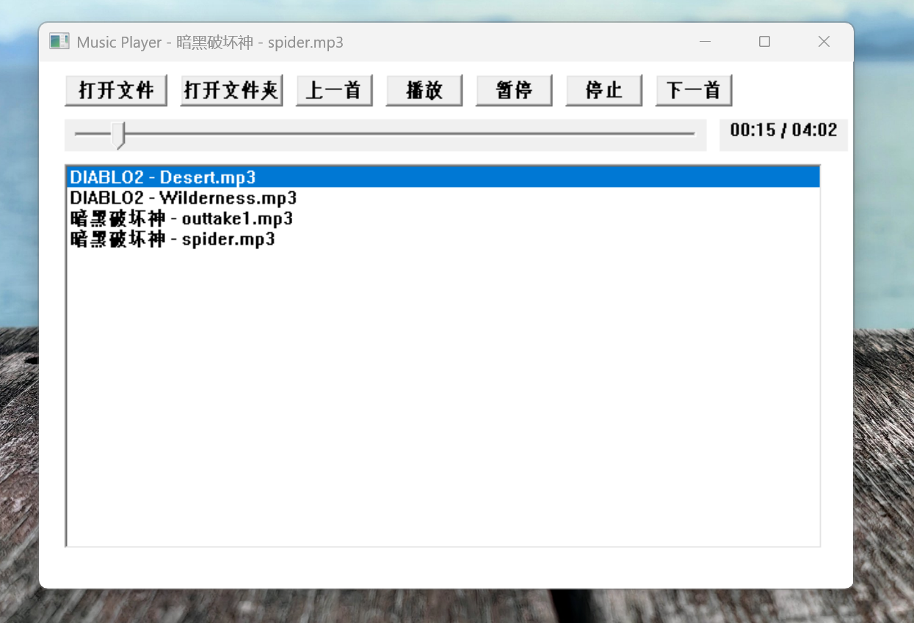

# 音乐播放器

基于 Windows 原生 API 的简易音乐播放器。

## 功能

- 播放 mp3、wav、wma、mid、midi 格式音频
- 打开单个文件或整个文件夹
- 文件夹自动扫描生成播放列表
- 进度条拖动定位
- 时间显示
- 上一首/下一首切换
- 自动播放下一首
- 双击列表项播放

## 截图



## 编译

```powershell
rm -rf build; cmake -B build; cmake --build build
```

输出：`build\Debug\MusicPlayer.exe` 或 `build\Release\MusicPlayer.exe`

## 环境

- Windows 11
- Visual Studio 2022 BuildTools
- CMake

## 依赖

Windows 原生 API：user32, gdi32, winmm, comdlg32, comctl32, ole32, shell32